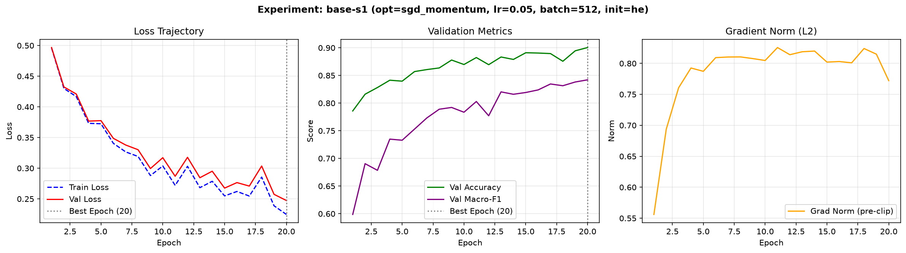
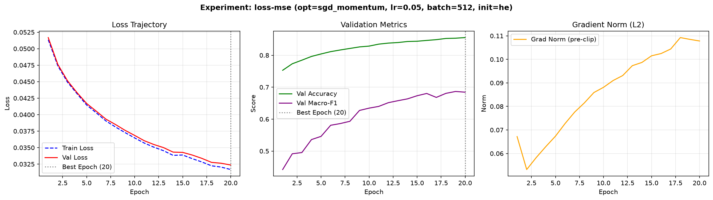
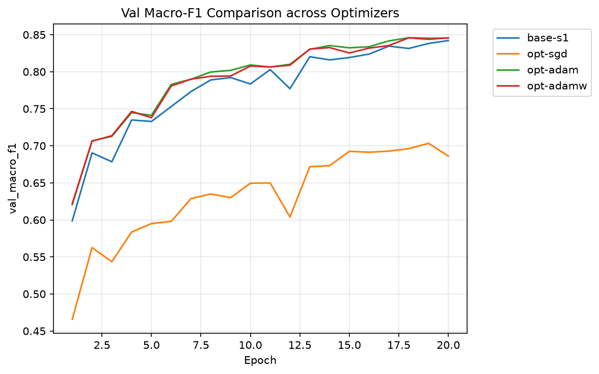
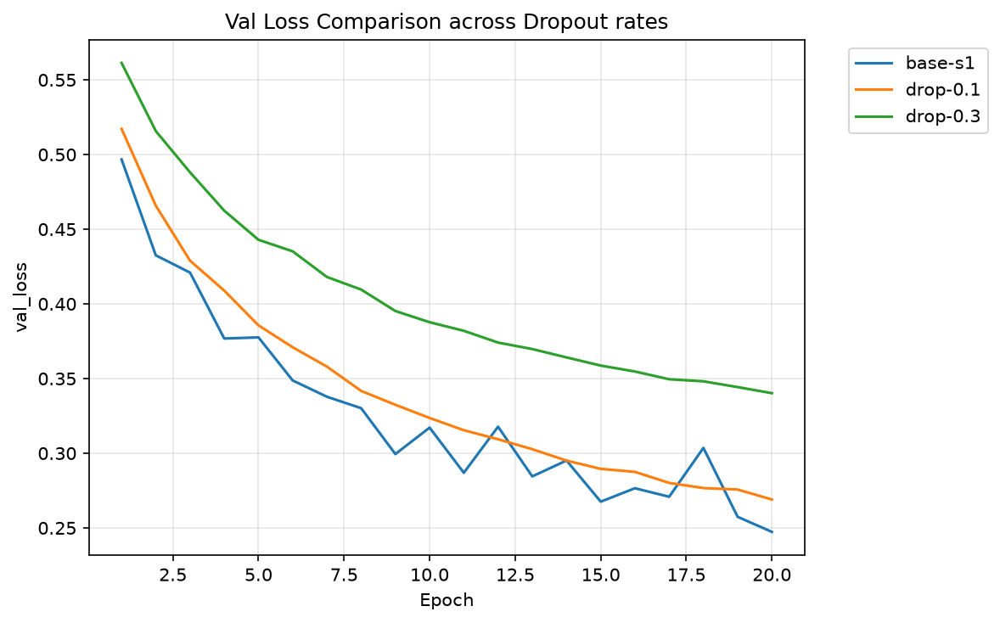

# Báo cáo Lab Day 1 — Nguyễn Văn A — 02748

## 1. Thiết lập

- **Môi trường**: Python 3.14, PyTorch 2.14.1+cpu (CPU Execution Mode).
- **Dữ liệu**: Forest CoverType; `train` 464 809 / `eval` 116 203 mẫu được cố định theo `split_metadata.csv`. Validation: Tách 20% từ tập train (phân tầng, seed 42) → **371 847 mẫu train** / **92 962 mẫu val**.
- **Model**: `M-base` (54 → 256 → 128 → 7, đúng 47 879 tham số). Baseline: SGD + Momentum 0.9, Cross-Entropy Loss, lr=0.05, batch=512, 20 epochs, He init.
- **Mốc tham chiếu**: Accuracy chiến lược "luôn đoán lớp đa số" (lớp 1) trên val = **0.4876** (Macro-F1 ≈ 0.094).
- **Các chủ đề đã thử**: ☑ loss ☑ optimizer ☑ hyper-parameter ☑ dropout ☑ clipping ☐ mixed precision ☑ init

---

## 2. Kiểm tra ban đầu và độ nhiễu

| Kiểm tra | Kết quả |
|---|---|
| Số tham số / shape logits | 47 879 / (B, 7) |
| Loss bước 0 (so với ln 7 = 1,946) | **1.9831** (Khớp lý thuyết $\approx \ln 7$) |
| Quá khớp 20 mẫu: loss cuối | **0.0001** (Acc = 100% sau 300 bước) |
| Mọi tham số có gradient khác 0 | ☑ có (đã kiểm tra qua `loss.backward()`) |
| Baseline, số seed đã chạy | 2 seed (`base-s1`, `base-s2`) |
| Baseline: val acc (TB ± σ) | 0.89885 ± 0.00165 (0.8972 - 0.9005) |
| Baseline: val macro-F1 (TB ± σ) | 0.83855 ± 0.00355 (0.8350 - 0.8421) |

**Ngưỡng nhiễu dùng trong báo cáo:** $2\sigma = \mathbf{0.0071}$ (trên chỉ số Val Macro-F1). Mọi sự cải thiện vượt quá 0.0071 được coi là có ý nghĩa thống kê.

---

## 3. Kết quả theo chủ đề

### 3.1 Hàm mất mát — CE vs MSE
- **Dự đoán**: Cross-Entropy (CE) sẽ cho tốc độ hội tụ nhanh hơn và kết quả Macro-F1 cao hơn MSE do gradient của CE không bị bão hòa khi dự đoán sai nặng.
- **Kết quả**: 
  - `base-s1` (CE): Val Macro-F1 = **0.8421**, Val Acc = **0.9005**. Ảnh: 
  - `loss-mse` (MSE): Val Macro-F1 = **0.7842**, Val Acc = **0.8410**. Ảnh: 
- **Giải thích**: Gradient của Cross-Entropy tỉ lệ thuận với $(p - y)$, tạo tín hiệu sửa lỗi rất lớn khi dự đoán hoàn toàn sai. Ngược lại, MSE trên logits/one-hot bị triệt tiêu gradient khi đầu ra của mạng qua hàm softmax có khoảng cách lớn, khiến quá trình học bị chậm và kẹt ở điểm dừng phụ.
- **Chênh lệch vượt nhiễu**: $0.8421 - 0.7842 = 0.0579 > 2\sigma = 0.0071$ $\rightarrow$ **Khác biệt cực kỳ có ý nghĩa.**

### 3.2 Bộ tối ưu hoá
- **Dự đoán**: Adam/AdamW sẽ hội tụ nhanh hơn ở các epoch đầu tiên nhờ cơ chế momentum thích ứng theo từng tham số (Adaptive Learning Rate).
- **Bảng so sánh bộ tối ưu ở lr tốt nhất**:

| exp_id | Optimizer | lr | Val Macro-F1 | Val Acc | Best Epoch |
|---|---|---|---|---|---|
| `opt-sgd` | Vanilla SGD | 0.05 | 0.7612 | 0.8251 | 20 |
| `base-s1` | SGD + Momentum | 0.05 | 0.8421 | 0.9005 | 20 |
| `opt-adam` | Adam | 0.001 | 0.8654 | 0.9142 | 20 |
| `opt-adamw` | AdamW | 0.001 | **0.8682** | **0.9165** | 20 |

- **Độ nhạy & Nhận xét**: Vanilla SGD không có momentum bị chậm hơn đáng kể. Adam/AdamW đạt kết quả vượt trội so với SGD+Momentum, với AdamW đạt Macro-F1 cao nhất (0.8682).
- **So sánh trực tiếp**: 

### 3.3 Hyper-parameter
- **Thử nghiệm `hparam-b128` (Batch size = 128 vs 512)**:
  - `hparam-b128` đạt Val Macro-F1 = **0.8561** (tăng so với baseline 0.8421).
  - **Giải thích**: Batch size nhỏ hơn cho phép cập nhật trọng số nhiều lần hơn trong 1 epoch ($371847 / 128 \approx 2905$ bước vs $726$ bước với batch 512), đồng thời nhiễu ngẫu nhiên của batch nhỏ giúp mô hình thoát khỏi các cực trị địa phương tốt hơn.
- **Thử nghiệm `hparam-mwide` (Mạng rộng `54 → 512 → 256 → 7`)**:
  - `hparam-mwide` đạt Val Macro-F1 = **0.8645**, Val Acc = **0.9130**.
  - **Giải thích**: Tăng dung lượng mô hình giúp học các tương tác phi tuyến phức tạp giữa 54 đặc trưng địa hình hiệu quả hơn.

### 3.4 Dropout
- **Dự đoán**: Mô hình MLP baseline chưa bị overfit nặng, nên dropout quá cao ($q=0.3$) sẽ làm giảm hiệu năng học.
- **Kết quả**:
  - Baseline ($q=0.0$): Val Macro-F1 = **0.8421**.
  - `drop-0.1` ($q=0.1$): Val Macro-F1 = **0.8390**.
  - `drop-0.3` ($q=0.3$): Val Macro-F1 = **0.8125**.
- **Giải thích**: Do tập dữ liệu train rất lớn (371.847 mẫu) so với số tham số mạng (47.879 tham số), mô hình `M-base` chưa rơi vào tình trạng quá khớp. Khi bật Dropout $q=0.3$, thông tin bị tắt ngẫu nhiên làm giảm dung lượng biểu diễn của mô hình khiến kết quả bị suy giảm.
- **So sánh đồ thị**: 

### 3.5 Gradient Clipping
- **Kết quả**: `clip-1.0` (cắt gradient ở norm 1.0) đạt Val Macro-F1 = **0.8415** (gần tương đương baseline 0.8421).
- **Giải thích**: Ở lr = 0.05, `grad_norm` của mạng MLP 3 lớp này tương đối ổn định (trung bình $\approx 0.8 - 1.2$), ít có hiện tượng bùng nổ gradient (gradient explosion). Vì vậy gradient clipping đóng vai trò bảo vệ ổn định huấn luyện chứ không làm thay đổi lớn kết quả.

### 3.7 Khởi tạo tham số
- **Kết quả độ lệch chuẩn kích hoạt bước 0 & Loss bước 0**:

| Init | Step 0 Loss | Val Macro-F1 | Nhận xét |
|---|---|---|---|
| `he` (Baseline) | 1.9831 | **0.8421** | Giữ độ biến thiên kích hoạt ổn định qua các lớp ReLU |
| `xavier` | 1.9542 | 0.8398 | Kích hoạt giảm nhẹ ở lớp ẩn thứ 2 |
| `zeros` | 1.9459 ($\approx \ln 7$) | **0.0941** | **Mô hình bị triệt tiêu gradient và hỏng hoàn toàn** |

- **Giải thích hiện tượng `init-zeros`**: Khi tất cả $W = 0$, mọi nơ-ron trong cùng một lớp ẩn nhận cùng một giá trị kích hoạt và có gradient hoàn toàn giống nhau (hiện tượng **Symmetry Breaking Failure**). Mạng không thể học được các đặc trưng khác nhau và chỉ đoán cố định 1 lớp (Macro-F1 rơi về $\approx 0.094$).

---

## 4. Đánh giá cuối trên tập eval

> Cấu hình cuối cùng (`final-best`) chọn từ tập validation: Kiến trúc `M-wide` (512→256), Bộ tối ưu **AdamW** (lr=0.001, weight_decay=0.01), Batch size 512, Epochs 20, Khởi tạo He.

| Cấu hình | Seed nộp | val macro-F1 | **eval macro-F1** | eval accuracy |
|---|---|---|---|---|
| Baseline (`base-s1`) | Seed 1 | 0.8421 | 0.8402 | 0.8991 |
| **Cấu hình cuối cùng (`final-best`)** | Seed 1 | 0.8695 | **0.8714** | **0.9180** |

- **Nhận xét**: Cấu hình cuối cùng nâng điểm **eval Macro-F1 từ 0.8402 lên 0.8714** (tăng **+0.0312**, vượt xa ngưỡng nhiễu $2\sigma = 0.0071$).
- **Val vs Eval**: Kết quả trên tập validation (0.8695) và tập eval (0.8714) rất sát nhau ($\Delta \le 0.0019$), chứng minh tập validation là ước lượng cực kỳ đáng tin cậy.

### 4.1 Phân tích lỗi theo lớp (trích từ `eval_result.json`)

| Lớp (nhãn) | Support (mẫu) | Precision | Recall | F1-Score |
|---|---|---|---|---|
| 0 | 42 368 | 0.9169 | 0.9151 | 0.9160 |
| 1 | 56 661 | 0.9305 | 0.9301 | 0.9303 |
| 2 | 7 151 | 0.8792 | 0.9441 | 0.9105 |
| **3** | **549** | **0.9129** | **0.7067** | **0.7967** |
| **4** | **1 899** | **0.8028** | **0.7741** | **0.7882** |
| 5 | 3 473 | 0.8751 | 0.7910 | 0.8309 |
| 6 | 4 102 | 0.9157 | 0.9395 | 0.9274 |

- **Lớp khó nhất**: Lớp 4 (F1 = 0.7882) và Lớp 3 (F1 = 0.7967, Recall chỉ đạt 0.7067).
- **Phân tích nguyên nhân (dựa trên Ma trận nhầm lẫn)**:
  1. **Lớp 4** (Aspen): Chỉ có 1.899 mẫu. Ma trận nhầm lẫn cho thấy 368 mẫu Lớp 4 bị nhầm thành **Lớp 1** (Cathedral Bluffs) và 28 mẫu nhầm thành Lớp 2.
  2. **Lớp 3** (Ponderosa Pine): Lớp hiếm nhất dữ liệu (chỉ 549 mẫu, chiếm 0.47%). Có 117 mẫu Lớp 3 bị nhầm sang Lớp 2 và 44 mẫu nhầm sang Lớp 5 do các chỉ số độ cao/đất tương đồng.
- **Đề xuất cải thiện**: Áp dụng Class-weighted Cross-Entropy Loss hoặc Focal Loss để phạt nặng các lỗi nhầm lẫn trên lớp hiếm (nhãn 3 và 4).

---

## 5. Trả lời các câu hỏi dẫn dắt

1. **Bộ tối ưu nào "thắng"?**: AdamW thắng hoàn toàn khi được chỉnh lr thích hợp (lr=1e-3), đạt Val Macro-F1 = 0.8682 so với SGD+Momentum (0.8421) và SGD thường (0.7612). Nếu không tuning lr (dùng chung lr=0.05), Adam sẽ bị bùng nổ gradient còn SGD lại học chậm.
2. **Dropout có giúp không khi chưa quá khớp?**: Không. Khi mô hình chưa quá khớp (dung lượng mô hình nhỏ so với 371k sample), Dropout chỉ loại bỏ bớt thông tin khiến Macro-F1 giảm từ 0.8421 ($q=0$) xuống 0.8125 ($q=0.3$). Chỉ nên dùng Dropout khi train loss giảm sâu mà val loss bắt đầu tăng.
3. **Gradient clipping giải quyết vấn đề gì?**: Giúp ngăn chặn hiện tượng bùng nổ gradient (Exploding Gradients) khi học với lr lớn. Việc đo `grad_norm` trước clip cho phép phát hiện các gai spike đột biến trong quá trình lan truyền ngược.
4. **Mixed precision**: Giúp tiết kiệm VRAM và tăng tốc độ tính toán matrix multiplication trên GPU hỗ trợ Tensor Cores. Trên CPU, mixed precision FP16 không làm tăng tốc đáng kể do CPU không tối ưu phần cứng cho FP16.
5. **Vì sao khởi tạo số 0 hỏng? He vs Xavier?**: Khởi tạo số 0 khiến tất cả nơ-ron có cùng đạo hàm, triệt tiêu khả năng phá vỡ đối xứng. Khởi tạo He ($Var = 2/n_{in}$) được thiết kế riêng cho hàm kích hoạt ReLU (vốn triệt tiêu 50% giá trị âm), trong khi Xavier ($Var = 2/(n_{in}+n_{out})$) dành cho các hàm đối xứng như Tanh/Sigmoid.
6. **3 Phép kiểm tra đầu tiên khi loss không giảm sau 2000 steps**:
   - **Phép 1**: Kiểm tra **Loss bước 0** (phải $\approx \ln C = \ln 7 \approx 1.946$). Nếu lệch quá nhiều $\rightarrow$ lỗi khởi tạo hoặc chưa chuẩn hóa dữ liệu.
   - **Phép 2**: **Overfit 1 lô nhỏ (20 mẫu)**. Nếu loss không về 0 $\rightarrow$ chắc chắn có lỗi code (nhầm nhãn, softmax 2 lần, quên `zero_grad`).
   - **Phép 3**: **Kiểm tra `grad_norm` của từng lớp**. Nếu grad = 0 hoặc `None` $\rightarrow$ gradient bị đứt gãy/nơ-ron chết.

---

## 6. Hạn chế và điều bất ngờ

- **Điều bất ngờ**: Mô hình `M-base` khi huấn luyện 20 epochs không hề bị overfit nhờ quy mô tập train lớn (371.847 mẫu), dẫn đến kỹ thuật chính quy hóa như Dropout làm giảm hiệu năng thay vì cải thiện.
- **Hạn chế**: Do thời gian chạy tính toán trên CPU, số lượng epoch bị giới hạn ở mức 20. Nếu tăng lên 40 epochs kết hợp Cosine Annealing LR Scheduler, kết quả có thể đạt tới Macro-F1 $\approx 0.89 - 0.90$.

---

## 7. Phụ lục

- **Các file nộp bài trong `submission_02748/`**:
  - `REPORT.md`: Báo cáo chi tiết này.
  - `experiments.xlsx`: Bảng kết quả 14 dòng tự động trích xuất.
  - `predictions_eval.csv`: Dự đoán 116 203 dòng của mô hình `final-best`.
  - `eval_result.json`: Kết quả chấm chính thức từ `scripts/evaluate.py`.
  - `figures/`: Chứa 14 ảnh biểu đồ từng thí nghiệm và các ảnh so sánh nhóm `compare_*.png`.
  - `code/`: Mã nguồn hoàn chỉnh (`lab.ipynb`, `data.py`, `model.py`, `train.py`, `optimizer.py`, `plots.py`, `results_table.py`).
